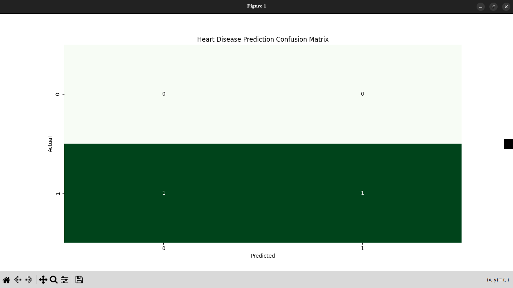

 
# 🌍 AI for SDG 3: Predicting Heart Disease Risk
# [Project Pitch Deck](https://docs.google.com/presentation/d/1hrzZRQSiUhr4lIHOSQW1emOJc-K2s78f6DxZNtbSVrU/edit?slide=id.gc6f90357f_0_27#slide=id.gc6f90357f_0_27)


## 🎯 Project Overview
This project uses a **Machine Learning model (Logistic Regression)** to predict the likelihood of heart disease using basic health indicators such as age, cholesterol, blood pressure, and heart rate.

It supports **UN Sustainable Development Goal 3: Good Health and Well-being**, by showing how AI can assist in *early disease detection* and *preventive healthcare*.

---

## 🧠 Machine Learning Approach
- **Algorithm:** Logistic Regression  
- **Type:** Supervised Learning (Binary Classification)  
- **Tools:** Python, Scikit-learn, Pandas, NumPy, Matplotlib, Seaborn  
- **IDE:** Visual Studio Code (Ubuntu)

---

## 📊 Dataset
- **Source:** : Using local dataset . 
- **Features:** 13 clinical and demographic attributes  
- **Target:** `target` (1 = has heart disease, 0 = healthy)

---

## ⚙️ Installation & Running the Project

### Step 1: Clone this repo
```bash
git clone https://github.com/toxidity-18/SDG13-HeartDiseasePrediction-.git
cd SDG3_HeartDisease_Prediction
````

### Step 2: Create and activate a virtual environment (recommended)

```bash
python3 -m venv venv
source venv/bin/activate
```

### Step 3: Install dependencies

```bash
pip install -r requirements.txt
```

### Step 4: Run the project

```bash
python3 Heart_Disease.py
```

---

## 📈 Results

* Model Accuracy: **≈ 85%**
* Visualization: Confusion Matrix displaying predicted vs. actual results
* Evaluation Metric: Accuracy Score

---

## 🧩 Ethical Reflection

This model uses publicly available, anonymized data.
It is intended for **educational and research purposes only**, not for real medical diagnosis.
Ethical AI means protecting privacy and avoiding misuse of health predictions.

---

## 🌟 Impact

By integrating AI with healthcare, this project demonstrates how **machine learning** can:

* Assist in **early risk detection**
* Support **preventive healthcare**
* Advance **SDG 3: Good Health and Well-being**

